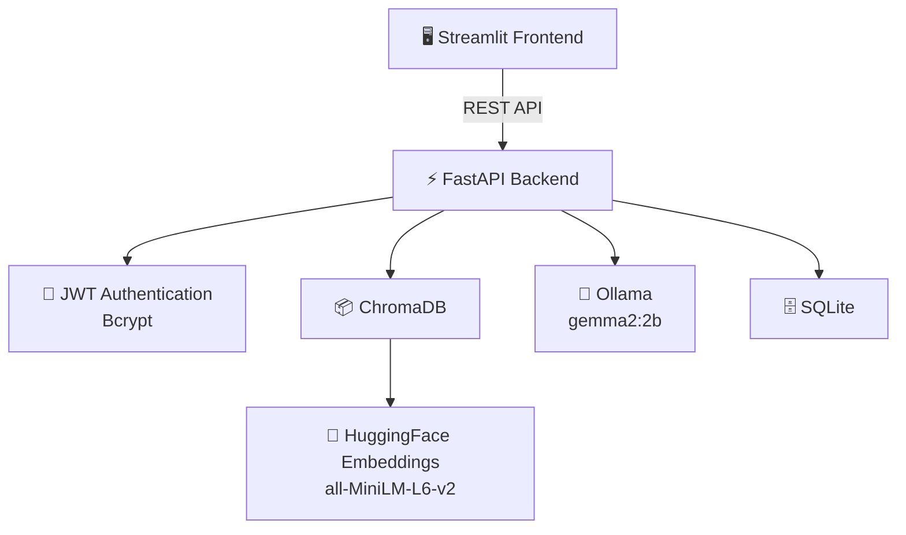
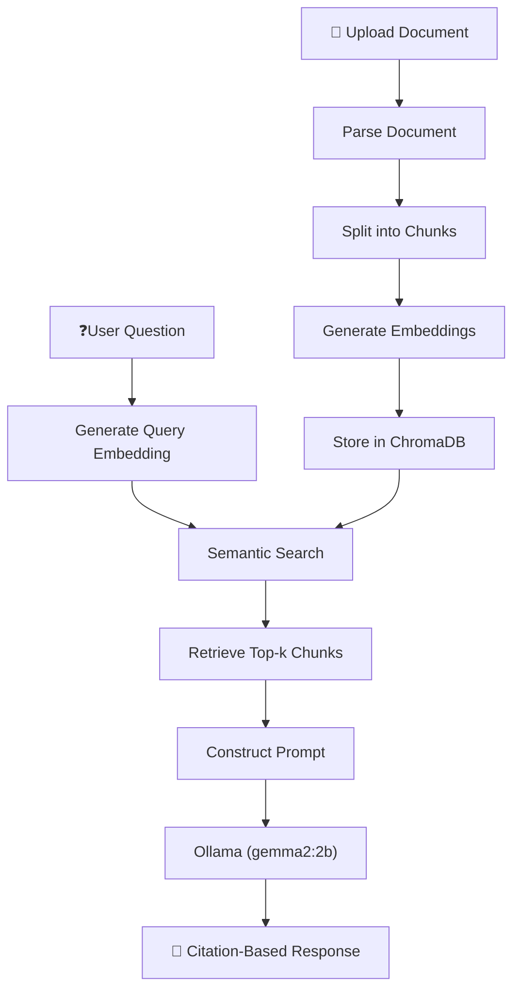

🤖 RAG-Based Document Q&A System with MLOps Pipeline


A production-grade, privacy-first Retrieval-Augmented Generation (RAG) platform that enables users to upload documents and interact with them through an intelligent AI-powered chat interface.

Built with a modern microservices architecture using FastAPI, Streamlit, LangChain, ChromaDB, and Ollama, this project follows IEEE 830 Software Requirements Specification (SRS) principles to ensure a structured, scalable, and maintainable design.

📖 Overview

This application allows users to securely upload documents in multiple formats and ask natural language questions about their contents.

Instead of relying on cloud-based AI services, the entire inference pipeline runs locally, ensuring complete data privacy, low latency, and zero dependency on external APIs.

The system combines semantic retrieval with a local Large Language Model (LLM) to generate accurate, context-aware answers while minimizing hallucinations.

✨ Features
📄 Multi-Format Document Support
Upload PDF documents
Upload Microsoft Word (.docx) files
Upload Text (.txt) files
Upload Markdown (.md) files
Automatic parsing and preprocessing
🧠 Retrieval-Augmented Generation (RAG)
Semantic document search
Context-aware answer generation
Intelligent document chunking
Vector embeddings for efficient retrieval
Cosine Similarity search
Relevant context extraction before inference
🚫 Hallucination Prevention

The LLM is strictly instructed to:

Answer only using retrieved document context
Never fabricate information
Clearly indicate when the requested information is unavailable
Provide citation-backed responses
🔒 Privacy-First AI

Unlike cloud-based solutions, this project is completely local.

✔ No OpenAI API

✔ No Gemini API

✔ No Claude API

✔ No external data transfer

Everything runs on your own machine.

🔐 Enterprise-Grade Security
JWT Authentication
Secure Login & Registration
Password hashing with Bcrypt
Protected API endpoints
User authentication middleware
💬 Interactive Chat Interface

Built using Streamlit with features including:

Modern responsive UI
Chat history
Source citations
Relevance scores
Clean conversational experience
⚡ Production-Ready Backend

Powered by FastAPI:

High-performance REST APIs
Automatic Swagger documentation
Modular architecture
Easy scalability
Async request handling
🐳 Dockerized Architecture

Fully containerized using Docker.

Services include:

FastAPI Backend
Streamlit Frontend
ChromaDB
SQLite Database

Run the entire project with a single command.

## 🏗️ System Architecture

```text
                        ┌─────────────────────────┐
                        │     Streamlit UI        │
                        │      (Frontend)         │
                        └──────────┬──────────────┘
                                   │
                            REST API Calls
                                   │
                        ┌──────────▼──────────────┐
                        │       FastAPI API       │
                        │       (Backend)         │
                        └──────────┬──────────────┘
                                   │
          ┌────────────────────────┼────────────────────────┐
          │                        │                        │
          ▼                        ▼                        ▼
 Authentication            Chroma Vector DB          Ollama LLM
 JWT + Bcrypt              Semantic Search            gemma2:2b
          │                        │                        │
          └───────────────┬────────┴───────────────┬────────┘
                          ▼                        ▼
             HuggingFace Embeddings        SQLite Database
                all-MiniLM-L6-v2
```

🛠️ Tech Stack
Programming Language
Python
Backend# 🤖 RAG-Based Document Q&A System with MLOps Pipeline


> **A production-grade, privacy-first Retrieval-Augmented Generation (RAG) platform that enables users to upload documents and interact with them through an intelligent AI-powered chat interface.**

Built with **FastAPI**, **Streamlit**, **LangChain**, **ChromaDB**, **Ollama**, and **HuggingFace Embeddings**, following **IEEE 830 Software Requirements Specification (SRS)** principles.

---

# 📚 Table of Contents

- Overview
- Features
- System Architecture
- Tech Stack
- Supported File Formats
- Quick Start
- Project Structure
- Workflow
- Key Highlights
- License

---

# 📖 Overview

This application allows users to upload PDF, DOCX, TXT, and Markdown documents and ask natural language questions about their contents.

The entire Retrieval-Augmented Generation (RAG) pipeline runs **locally**, ensuring **complete privacy**, **low latency**, and **zero dependence on external AI APIs**.

---

# ✨ Features

## 📄 Multi-Format Document Support

- PDF
- DOCX
- TXT
- Markdown
- Automatic parsing and preprocessing

## 🧠 Retrieval-Augmented Generation

- Semantic document search
- Intelligent chunking
- Vector embeddings
- Cosine similarity retrieval
- Context-aware answer generation

## 🚫 Hallucination Prevention

- Answers only from retrieved context
- No fabricated responses
- Citation-backed answers
- Graceful fallback when information is unavailable

## 🔒 Privacy-First AI

- ✅ No OpenAI API
- ✅ No Gemini API
- ✅ No Claude API
- ✅ 100% Local Processing

## 🔐 Enterprise Security

- JWT Authentication
- Bcrypt Password Hashing
- Protected REST APIs
- Secure User Authentication

## 💬 Modern User Interface

- Interactive Streamlit Chat
- Chat History
- Source Citations
- Relevance Scores

## 🐳 Dockerized Deployment

- FastAPI Backend
- Streamlit Frontend
- ChromaDB
- SQLite

---

# 🏗️ System Architecture



---

# 🛠️ Tech Stack

| Category | Technologies |
|-----------|--------------|
| Language | Python |
| Backend | FastAPI, LangChain, Pydantic |
| Frontend | Streamlit |
| AI/ML | Ollama, gemma2:2b, HuggingFace, all-MiniLM-L6-v2 |
| Vector Database | ChromaDB |
| Database | SQLite |
| Authentication | JWT, Bcrypt |
| DevOps | Docker, Docker Compose |

---

# 📂 Supported File Formats

| Format | Supported |
|--------|-----------|
| PDF | ✅ |
| DOCX | ✅ |
| TXT | ✅ |
| Markdown | ✅ |

---

# 🚀 Quick Start

## Prerequisites

- Docker Desktop
- Docker Compose
- Ollama

Pull the model:

```bash
ollama run gemma2:2b
```

Clone the repository:

```bash
git clone https://github.com/srinikavuppala/rag-qa-mlops.git
cd rag-qa-mlops
```

Run the project:

```bash
docker-compose up --build
```

### Access

- **Frontend:** http://localhost:8501
- **Backend:** http://localhost:8000
- **Swagger Docs:** http://localhost:8000/docs

---

# 📁 Project Structure

```text
rag-qa-mlops/
├── backend/
│   ├── api/
│   ├── auth/
│   ├── database/
│   ├── models/
│   ├── services/
│   ├── main.py
│   └── requirements.txt
├── frontend/
│   ├── streamlit_app.py
│   └── requirements.txt
├── chroma_db/
├── uploads/
├── Dockerfile
├── docker-compose.yml
├── README.md
└── requirements.txt
```

---

# 🔄 Workflow



---

# 🎯 Key Highlights

- ✅ Production-grade RAG implementation
- ✅ Fully local AI inference
- ✅ Privacy-first architecture
- ✅ IEEE 830 SRS compliant design
- ✅ Dockerized microservices
- ✅ JWT authentication
- ✅ Multi-format document ingestion
- ✅ Semantic search using vector embeddings
- ✅ Citation-backed responses
- ✅ FastAPI REST APIs
- ✅ Interactive Streamlit interface
- ✅ Swagger API documentation

---

# 📜 License

This project is intended for educational, research, and portfolio purposes.

---

# ⭐ Support

If you found this project useful, consider giving it a **⭐ Star** on GitHub.

FastAPI
LangChain
Pydantic
Frontend
Streamlit

AI & Machine Learning

Ollama
gemma2:2b
HuggingFace Transformers
all-MiniLM-L6-v2 Embeddings

Vector Database

ChromaDB
Database
SQLite

Authentication

JWT
Bcrypt
DevOps
Docker
Docker Compose

📂 Supported File Formats

Format	Supported
PDF	        ✅
DOCX	    ✅
TXT	        ✅
Markdown	✅

🚀 Quick Start
Prerequisites

Before running the project, install:

Docker Desktop
Docker Compose
Ollama

Pull the LLM model:
ollama run gemma2:2b

Clone the Repository

git clone https://github.com/srinikavuppala/rag-qa-mlops.git

cd rag-qa-mlops

Build and Run
docker-compose up --build
Access the Application
Streamlit Frontend
http://localhost:8501
FastAPI Backend
http://localhost:8000
Swagger API Documentation
http://localhost:8000/docs

## 📁 Project Structure

```text
rag-qa-mlops/
├── backend/
│   ├── api/
│   ├── auth/
│   ├── database/
│   ├── models/
│   ├── services/
│   ├── utils/
│   ├── main.py
│   └── requirements.txt
│
├── frontend/
│   ├── pages/
│   ├── components/
│   ├── streamlit_app.py
│   └── requirements.txt
│
├── chroma_db/
├── uploads/
├── Dockerfile
├── docker-compose.yml
├── .env
├── .gitignore
├── README.md
└── LICENSE
```

## 🔄 Workflow

```text
User Uploads Document
        │
        ▼
Document Parsing
        │
        ▼
Text Chunking
        │
        ▼
Embedding Generation
        │
        ▼
Store Embeddings in ChromaDB
        │
        ▼
User Asks Question
        │
        ▼
Semantic Retrieval
        │
        ▼
Relevant Context Retrieved
        │
        ▼
Prompt Construction
        │
        ▼
Ollama (gemma2:2b)
        │
        ▼
Citation-Based Response
```

## 🎯 Key Highlights

- ✅ Production-grade RAG implementation
- ✅ Fully local AI inference
- ✅ Privacy-first architecture
- ✅ IEEE 830 SRS compliant design
- ✅ Dockerized microservices
- ✅ JWT authentication
- ✅ Multi-format document ingestion
- ✅ Semantic search using vector embeddings
- ✅ Citation-backed responses
- ✅ FastAPI REST APIs
- ✅ Interactive Streamlit interface
- ✅ Swagger API documentation

📜 License

This project is intended for educational, research, and portfolio purposes. Feel free to fork, customize, and extend it for your own use.

⭐ If you found this project useful

If this repository helped you or inspired your work, consider starring ⭐ the repository to support future development.